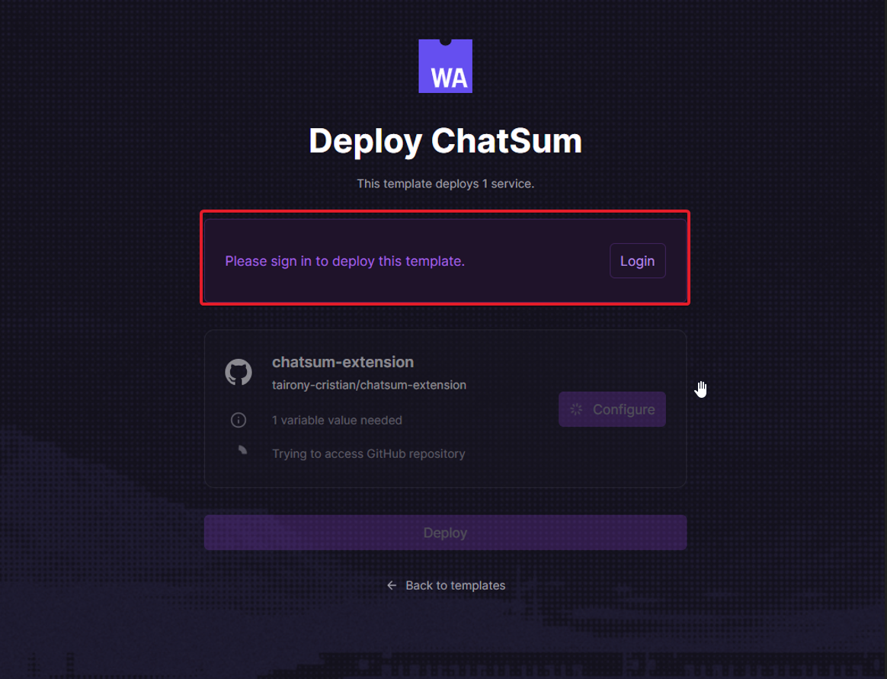
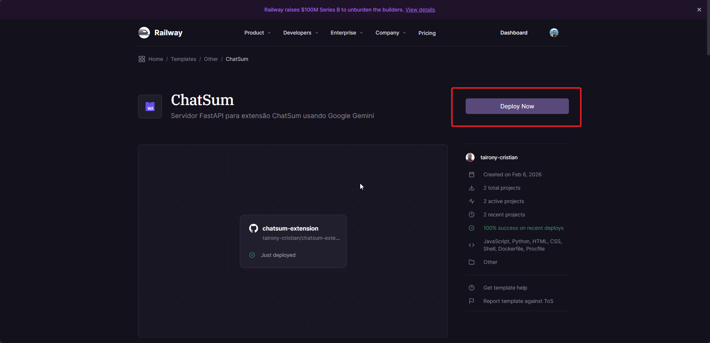
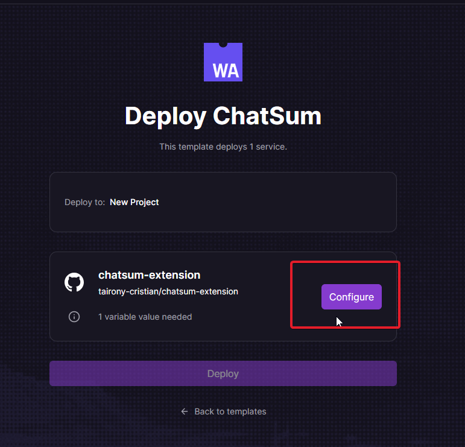
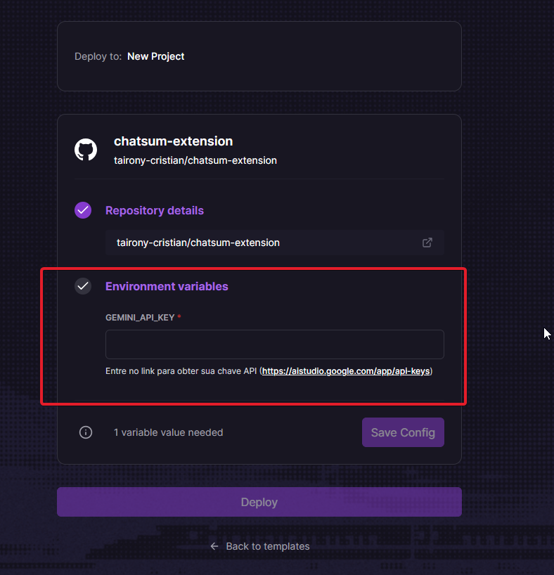
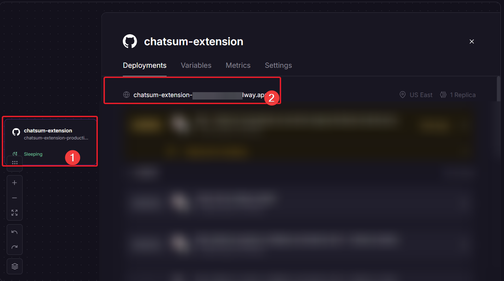
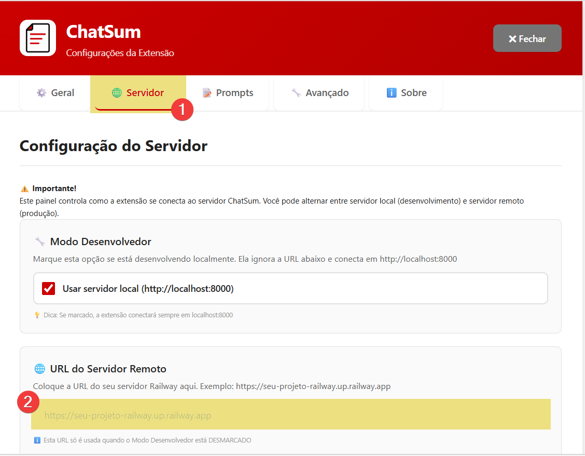
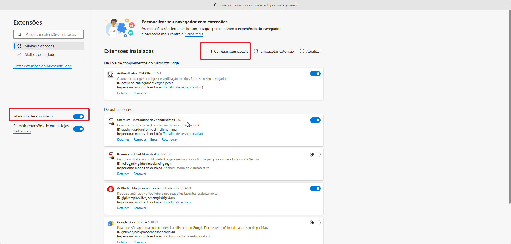
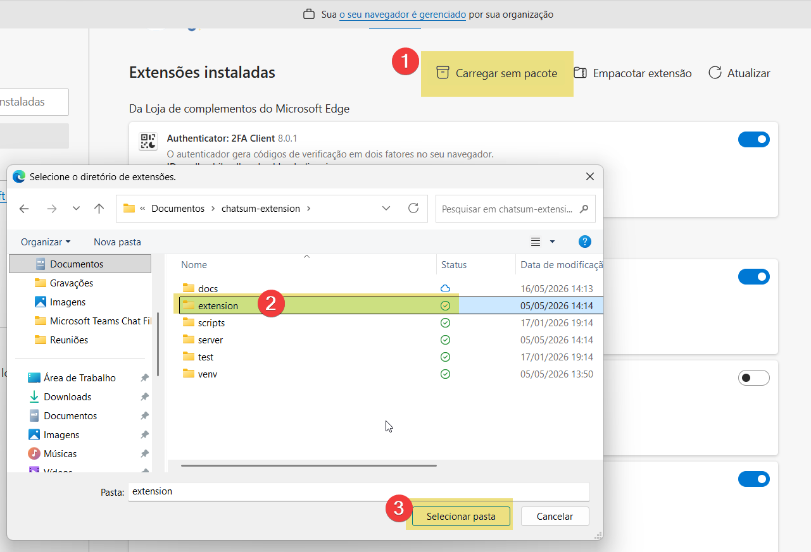
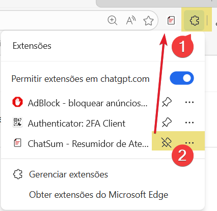

# 📦 Guia de Instalação — ChatSum

---

## 📋 Índice

1. [Escolha seu modo de instalação](#-escolha-seu-modo-de-instalação)
2. [Instalar a Extensão Chrome](#-instalar-a-extensão-chrome)
3. [Configurar o Servidor em Nuvem (Railway)](#-opção-a--servidor-em-nuvem-railway)
4. [Configurar o Servidor Local](#-opção-b--servidor-local)
5. [Configurar as Chaves de API](#-configurar-as-chaves-de-api)
6. [Verificar a Instalação](#-verificar-a-instalação)
7. [Problemas Comuns](#-problemas-comuns)

---

## 🚀 Deploy Rápido do Servidor (Railway)

Clique no botão abaixo para fazer o deploy automático do servidor na nuvem:

[](https://railway.com/deploy/chatsum?referralCode=TXae0K&utm_medium=integration&utm_source=template&utm_campaign=generic)

### 🧾 O que você vai precisar
- Uma conta no GitHub ou  no Gmail (gratuita)
- Uma conta no Railway (gratuita)
- Uma chave de API de IA (gratuita — veja [Configurar as Chaves de API](#-configurar-as-chaves-de-api))

### 🪜 Passo a passo
1. Clique no botão **Deploy on Railway** acima
2. Faça login no Railway com sua conta GitHub
<p align="left">  </p>

3. Clique no botão deploy
<p align="left">  </p>


4. Informe ao menos uma chave de IA nas variáveis de ambiente
<p align="left">  </p>
<p align="left">  </p>

5. Clique em **Deploy**
6. Aguarde o deploy finalizar (2-3 minutos)
7. Copie a URL gerada (ex: `https://seu-projeto.up.railway.app`)
<p align="left">  </p>

8. Cole essa URL nas configurações da extensão → aba **Servidor**
<p align="left">  </p>

### 🔑 Variáveis de ambiente obrigatórias

Configure ao menos **UMA** das chaves abaixo no painel do Railway:

| Variável | Provedor | Plano Gratuito | Onde obter |
|---|---|---|---|
| `GEMINI_API_KEY` | Google Gemini | ✅ 20 req/dia | [aistudio.google.com/apikey](https://aistudio.google.com/apikey) |
| `GROQ_API_KEY` | Groq | ✅ Generoso | [console.groq.com/keys](https://console.groq.com/keys) |
| `OPENAI_API_KEY` | OpenAI (GPT) | ⚠️ Pago | [platform.openai.com/api-keys](https://platform.openai.com/api-keys) |

> ⚠️ **Atenção Gemini:** O plano gratuito permite até **20 requisições por dia**. Se o limite for atingido, configure o Groq como alternativa — o fallback automático cuidará do restante.

🔒 Suas chaves ficam privadas e só são usadas no seu projeto Railway.

---

## 🤔 Escolha seu modo de instalação

| | ☁️ Nuvem (Railway) | 🖥️ Local |
|---|---|---|
| **Dificuldade** | Fácil | Médio |
| **Requisitos** | Só o Chrome | Python 3.8+ |
| **Internet** | Sempre necessária | Só para a IA |
| **Velocidade** | Pode ter delay ao acordar | Rápido |
| **Custo** | Gratuito (Railway free tier) | Gratuito |

> **Recomendação:** Use o servidor em nuvem para começar. Se precisar de mais controle, configure o local.

---

## 🌐 Instalar a Extensão Chrome

Independente da opção de servidor, a extensão é instalada da mesma forma.

### Passo 1 — Baixe o projeto

```powershell
git clone https://github.com/tairony-cristian/chatsum-extension.git
```

Ou baixe o ZIP pelo GitHub e extraia em uma pasta fixa (não mova depois).

### Passo 2 — Abra o gerenciador de extensões

No Chrome, acesse: `chrome://extensions/`

### Passo 3 — Ative o Modo Desenvolvedor

A sua esquerda, ligue a chave **"Modo do desenvolvedor"**.
<p align="left">  </p>

### Passo 4 — Carregue a extensão

1. Clique em **"Carregar sem compactação"**
2. Navegue até a pasta do projeto
3. Selecione a pasta raiz `chatsum-extension/` (onde está o `manifest.json`)
4. Clique em **"Selecionar pasta"**
<p align="left">  </p>

### Passo 5 — Fixe a extensão na barra

1. Clique no ícone de puzzle 🧩 ao lado da barra de endereço
2. Localize **ChatSum** na lista
3. Clique no alfinete 📌 para fixar
<p align="left">  </p>

✅ O ícone 📋 do ChatSum aparecerá na barra do Chrome.

---

## ☁️ Opção A — Servidor em Nuvem (Railway)

> Nenhuma instalação de Python necessária.

### Passo 1 — Abra as configurações da extensão

Clique no ícone 📋 do ChatSum → clique em ⚙️ (canto superior direito).

### Passo 2 — Configure o servidor

1. Vá para a aba **Servidor**
2. **Desmarque** a opção **"Modo Desenvolvedor"**
3. No campo **URL do Servidor**, cole:
   ```
   https://seu-projeto.up.railway.app
   ```
4. Clique em **💾 Salvar Configurações**

### Passo 3 — Teste a conexão

Clique em **"Testar Conexão"**. Você deve ver:

```
✅ Conexão Bem-sucedida!
Servidor: https://seu-projeto.up.railway.app
Status: ok
```

### Passo 4 — Configure sua chave de IA

Vá para a aba **Geral** e selecione o provedor de IA que deseja usar.

As chaves devem ser configuradas no servidor Railway.

> ⚠️ **Atenção:** O servidor Railway entra em modo de hibernação após 30 minutos sem uso. Na primeira requisição do dia pode demorar 10-20 segundos para "acordar". Isso é normal.

---

## 🖥️ Opção B — Servidor Local

### Requisitos

| Software | Versão | Link |
|---|---|---|
| Python | 3.8+ | [python.org](https://www.python.org/downloads/) |
| Git | 2.0+ | [git-scm.com](https://git-scm.com/) |

### Passo 1 — Acesse a pasta do servidor

```powershell
cd chatsum-extension/server
```

### Passo 2 — Crie o ambiente virtual

**Windows:**
```powershell
python -m venv .venv
.venv\Scripts\Activate.ps1
```

> Se der erro de política de execução:
> ```powershell
> Set-ExecutionPolicy -Scope Process -ExecutionPolicy RemoteSigned
> .venv\Scripts\Activate.ps1
> ```

**Linux/Mac:**
```bash
python3 -m venv .venv
source .venv/bin/activate
```

### Passo 3 — Instale as dependências

```powershell
pip install -r requirements.txt
```

### Passo 4 — Configure as variáveis de ambiente

Crie o arquivo `.env` na pasta `server/`:

```powershell
copy .env.example .env
```

Abra o `.env` e preencha ao menos uma chave de IA:

```env
# Configure ao menos UMA das chaves abaixo
GEMINI_API_KEY=sua_chave_gemini_aqui
GROQ_API_KEY=sua_chave_groq_aqui
OPENAI_API_KEY=sua_chave_openai_aqui

# Configurações opcionais (valores padrão já funcionam)
SERVER_HOST=127.0.0.1
SERVER_PORT=8000
MAX_REQUESTS_PER_DAY=50
LOG_LEVEL=INFO
```

### Passo 5 — Inicie o servidor

```powershell
python main.py
```

Saída esperada:
```
============================================================
🚀 ChatSum API v2.0.0 - Iniciando...
📡 Servidor: 127.0.0.1:8000
🤖 Provedores: Gemini / Groq / OpenAI
📊 Rate Limit: 20 req/dia
============================================================
INFO: Application startup complete.
INFO: Uvicorn running on http://127.0.0.1:8000
```

### Passo 6 — Configure a extensão para usar o servidor local

1. Abra as configurações da extensão ⚙️ → aba **Servidor**
2. **Marque** a opção **"Modo Desenvolvedor"**
3. Clique em **💾 Salvar Configurações**
4. Clique em **"Testar Conexão"** para verificar

---

## 🔑 Configurar as Chaves de API

### Google Gemini (recomendado — gratuito)

1. Acesse [aistudio.google.com/apikey](https://aistudio.google.com/apikey)
2. Faça login com sua conta Google
3. Clique em **"Create API Key"**
4. Copie a chave e cole no `.env`:
   ```env
   GEMINI_API_KEY=AIzaSy...
   ```

### Groq (gratuito — muito rápido)

1. Acesse [console.groq.com/keys](https://console.groq.com/keys)
2. Crie uma conta gratuita
3. Clique em **"Create API Key"**
4. Cole no `.env`:
   ```env
   GROQ_API_KEY=gsk_...
   ```

### OpenAI / GPT (pago)

1. Acesse [platform.openai.com/api-keys](https://platform.openai.com/api-keys)
2. Crie ou acesse sua conta
3. Clique em **"Create new secret key"**
4. Cole no `.env`:
   ```env
   OPENAI_API_KEY=sk-...
   ```

---

## ✅ Verificar a Instalação

### Checklist

- [ ] Ícone 📋 do ChatSum aparece na barra do Chrome
- [ ] Clicando no ícone, o popup abre com as abas **Resumir** e **Histórico**
- [ ] Nas configurações ⚙️, o teste de conexão retorna ✅
- [ ] Na aba **Geral**, o provedor de IA aparece configurado

### Teste funcional

1. Abra um ticket no Movidesk
2. Clique no ícone do ChatSum
3. Clique em **Capturar e Resumir**
4. O resumo deve aparecer em 5-15 segundos

---

## 🐛 Problemas Comuns

### ❌ "Servidor offline" ou timeout

**Causa:** Servidor não está rodando ou URL errada.

**Solução:**
- Servidor local: verifique se o terminal com `python main.py` está aberto
- Railway: o servidor pode estar hibernando — aguarde 20 segundos e tente novamente
- Verifique a URL nas configurações

### ❌ "Nenhuma mensagem encontrada"

**Causa:** A extensão não conseguiu capturar o chat.

**Solução:**
1. Certifique-se de estar em uma conversa aberta no Movidesk
2. Aguarde a página carregar completamente antes de capturar
3. Se o chat tiver botões "Carregar mais", a extensão clicará neles automaticamente — aguarde

### ❌ Erro de política de execução (Windows)

**Causa:** PowerShell bloqueando scripts.

**Solução:**
```powershell
Set-ExecutionPolicy -Scope Process -ExecutionPolicy RemoteSigned
```

### ❌ "Porta 8000 já em uso"

**Solução Windows:**
```powershell
netstat -ano | findstr :8000
taskkill /PID <numero_do_pid> /F
```

**Ou mude a porta no `.env`:**
```env
SERVER_PORT=8001
```

### ❌ Extensão não carrega no Chrome

**Causa mais comum:** Selecionou a pasta errada.

**Solução:** A pasta deve ser a raiz do projeto onde está o arquivo `manifest.json`. Não selecione uma subpasta.

### ❌ Razão social ou ticket incorretos no histórico

**Causa:** Dados extraídos de outra aba aberta.

**Solução:** Garanta que a aba do ticket desejado está **ativa** (clicada) antes de capturar. Os dados são extraídos da aba ativa no momento do clique em Capturar.

---

## 📞 Suporte

- 📧 Email: taironycristian@yahoo.com.br
- 🐛 [Reportar Bug](https://github.com/tairony-cristian/chatsum-extension/issues)