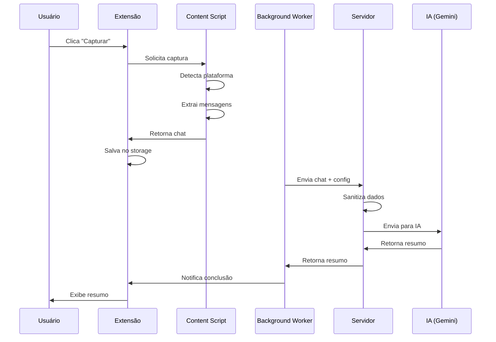

# 📋 ChatSum - Resumidor Inteligente de Atendimentos


> Extensão Chrome que gera resumos técnicos automáticos de conversas de suporte usando Inteligência Artificial (Google Gemini).

## 🎯 **Características Principais**

- ✨ **Resumo Automático**: Gera resumos técnicos profissionais com um clique
- 🤖 **IA Avançada**: Powered by Google Gemini 2.5
- 📝 **Prompts Personalizáveis**: Customize o estilo dos resumos
- 🔄 **Dois Modos**: Resumo completo ou apenas do último técnico
- 🔒 **Seguro**: Sanitização automática de dados sensíveis
- 🎨 **Interface Moderna**: Design intuitivo e responsivo
- 🌐 **Multi-plataforma**: Suporta Zendesk, Freshdesk, Intercom, WhatsApp Web e mais

## 📸 **Screenshots**

### Popup da Extensão


### Página de Configurações


### Exemplo de Resumo


## 🚀 **Instalação**

### **Pré-requisitos**

- Google Chrome (versão 88+)
- Python 3.8+
- Chave de API do Google Gemini ([Obter aqui](https://aistudio.google.com/app/apikey))

### **Passo 1: Clone o Repositório**
```bash
git clone https://github.com/seu-usuario/chatsum-extension.git
cd chatsum-extension
```

### **Passo 2: Configure o Servidor**
```bash
# Entre na pasta do servidor
cd server

# Crie ambiente virtual
python -m venv venv

# Ative o ambiente virtual
# Windows:
venv\Scripts\activate
# Linux/Mac:
source venv/bin/activate

# Instale dependências
pip install -r requirements.txt

# Configure variáveis de ambiente
cp .env.example .env
# Edite o arquivo .env e adicione sua GEMINI_API_KEY
```

### **Passo 3: Inicie o Servidor**
```bash
# Dentro de /server com venv ativado
python main.py
```

O servidor estará rodando em `http://localhost:8000`

### **Passo 4: Instale a Extensão no Chrome**

1. Abra o Chrome e acesse `chrome://extensions/`
2. Ative o **Modo do desenvolvedor** (canto superior direito)
3. Clique em **Carregar sem compactação**
4. Selecione a pasta `chatsum-extension/extension`
5. A extensão será instalada e aparecerá na barra de ferramentas

## 📖 **Como Usar**

### **Uso Básico**

1. **Abra uma conversa de suporte** em qualquer plataforma suportada
2. **Clique no ícone do ChatSum** na barra de ferramentas
3. **Selecione o modo** de resumo (Último Técnico ou Completo)
4. **Clique em "Capturar e Resumir"**
5. Aguarde alguns segundos e **seu resumo estará pronto!**
6. **Copie** o resumo formatado com um clique

### **Configurações Avançadas**

#### **Prompts Personalizados**

1. Clique no ícone **⚙️ Configurações** no popup
2. Acesse a aba **📝 Prompts**
3. Selecione "Personalizado" no dropdown
4. Edite o prompt conforme sua necessidade
5. Use variáveis como `{ultimo_tecnico}` para personalização
6. Clique em **Validar** e depois **Salvar**

#### **Modos de Resumo**

**Último Técnico** (Recomendado para documentação)
- Resume apenas ações do técnico atual
- Ideal para documentar ticket no CRM
- Formato em primeira pessoa

**Completo** (Recomendado para relatórios)
- Inclui ações de todos os técnicos
- Ideal para handover ou análise
- Formato cronológico

## 🏗️ **Arquitetura**
```
chatsum-extension/
├── extension/              # Chrome Extension
│   ├── manifest.json      # Configuração da extensão
│   ├── background.js      # Service Worker
│   ├── popup/             # Interface do usuário
│   ├── options/           # Página de configurações
│   ├── content/           # Script de captura
│   └── utils/             # Utilitários compartilhados
│
└── server/                # Backend FastAPI
    ├── main.py           # API principal
    ├── config/           # Configurações
    ├── services/         # Lógica de negócio
    ├── models/           # Schemas Pydantic
    └── prompts/          # Templates de prompts
```

### **Fluxo de Funcionamento**


## 🔧 **Desenvolvimento**

### **Estrutura de Branches**

- `main` - Produção (estável)
- `develop` - Desenvolvimento
- `feature/*` - Novas funcionalidades
- `bugfix/*` - Correções de bugs

### **Rodando em Modo Debug**

1. Ative o **Modo Debug** nas configurações da extensão
2. Abra o DevTools (F12) na página de teste
3. Veja logs detalhados no console

### **Executando Testes**
```bash
# Backend
cd server
pytest tests/

# Frontend (manual)
# Abra test/test-page.html no Chrome com a extensão carregada
```

### **Build para Produção**
```bash
# Cria pacote .zip da extensão
cd extension
zip -r ../chatsum-extension-v2.0.0.zip . -x "*.git*" "*.DS_Store"
```

## 🔒 **Segurança**

### **Dados Sanitizados Automaticamente**

A extensão remove automaticamente:
- ✅ Telefones
- ✅ CPF/CNPJ
- ✅ E-mails
- ✅ IPs
- ✅ Senhas
- ✅ Códigos de acesso remoto
- ✅ Tokens/API Keys

### **Boas Práticas**

- ❌ **NUNCA** commite arquivos `.env`
- ✅ Use `.env.example` como template
- ✅ Mantenha sua API key segura
- ✅ Revise resumos antes de compartilhar

## 📊 **Limitações**

- **Quota Diária**: 50 requisições/dia (plano gratuito Gemini)
- **Tamanho do Chat**: Máximo 50.000 caracteres
- **Plataformas**: Funciona melhor em sistemas web modernos
- **Idioma**: Otimizado para português brasileiro

## 🐛 **Troubleshooting**

### **Erro: "Servidor offline"**
```bash
# Verifique se o servidor está rodando
cd server
python main.py
```

### **Erro: "Quota excedida"**
- Aguarde 24h ou faça upgrade do plano Gemini
- Verifique contador na extensão

### **Erro: "Chat não capturado"**
- Verifique se está em uma página de chat ativa
- Ative o modo debug para mais informações
- Reporte a plataforma não suportada [aqui](https://github.com/seu-usuario/chatsum-extension/issues)

### **Servidor não inicia**
```bash
# Verifique se porta 8000 está livre
netstat -ano | findstr :8000  # Windows
lsof -i :8000                 # Linux/Mac

# Se necessário, mude a porta no .env
SERVER_PORT=8001
```

## 🤝 **Contribuindo**

Contribuições são bem-vindas! Veja [CONTRIBUTING.md](CONTRIBUTING.md) para detalhes.

### **Como Contribuir**

1. Fork o projeto
2. Crie uma branch (`git checkout -b feature/MinhaFeature`)
3. Commit suas mudanças (`git commit -m 'Adiciona MinhaFeature'`)
4. Push para a branch (`git push origin feature/MinhaFeature`)
5. Abra um Pull Request

## 📝 **Changelog**

### **v2.0.0** (2025-01-15)
- ✨ Sistema de prompts personalizáveis
- 🔄 Modo de resumo completo
- 🛡️ Sistema de lock para múltiplas abas
- 🎨 Interface completamente redesenhada
- ⚡ Background processing
- 🔒 Melhorias de segurança

### **v1.0.0** (2024-12-01)
- 🎉 Lançamento inicial
- 📋 Captura básica de chat
- 🤖 Integração com Gemini AI

## 📄 **Licença**

Este projeto está sob a licença MIT. Veja [LICENSE](LICENSE) para mais detalhes.

## 👤 **Autor**

**Seu Nome**
- GitHub: [@seu-usuario](https://github.com/seu-usuario)
- LinkedIn: [Seu Perfil](https://linkedin.com/in/seu-perfil)
- Email: seu.email@example.com

## 🙏 **Agradecimentos**

- Google Gemini AI pela API
- Comunidade Open Source
- Todos os contribuidores

---

<p align="center">
  Feito com ❤️ para a comunidade de suporte técnico
</p>