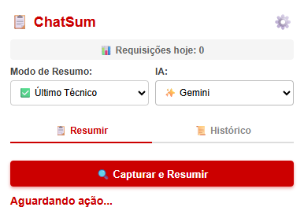
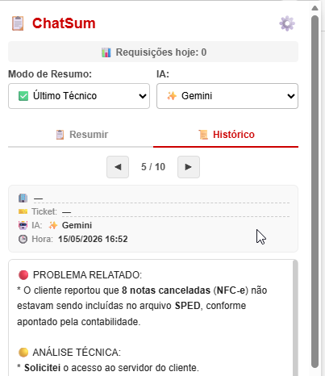
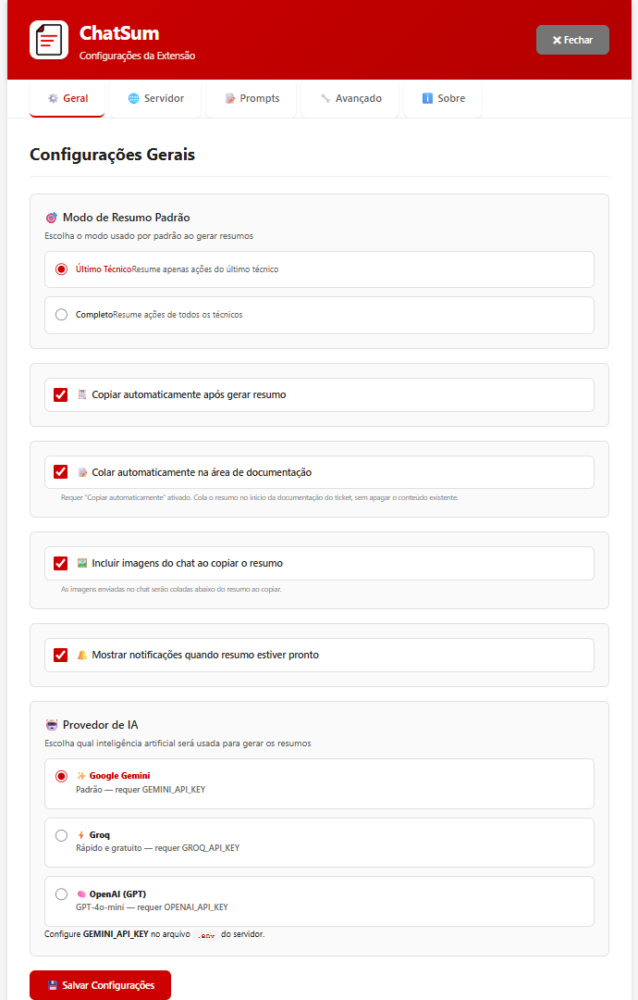
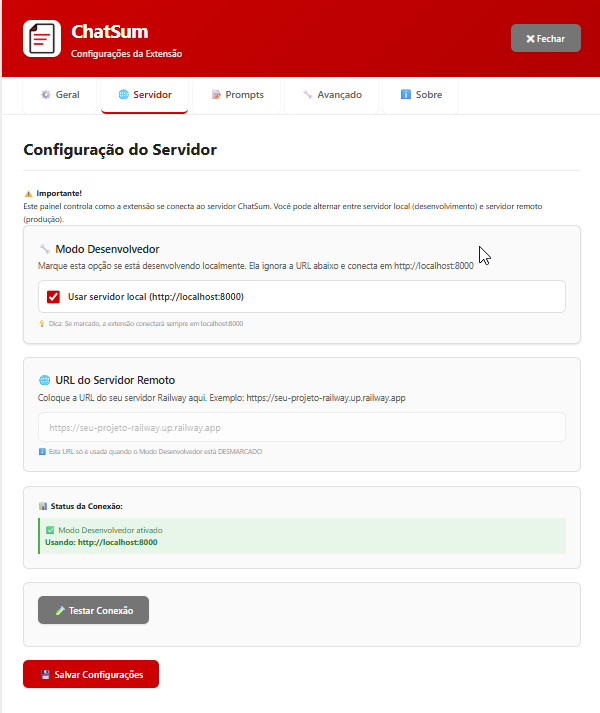
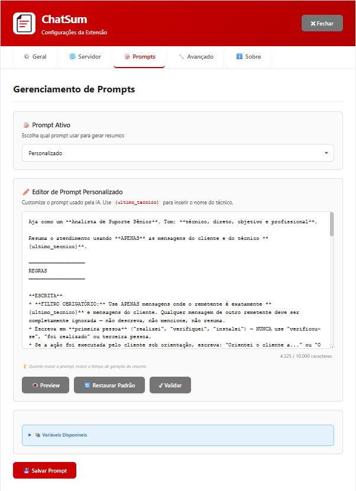
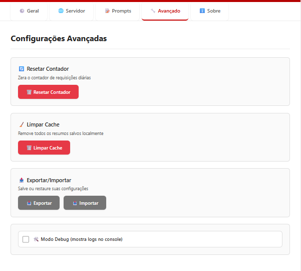

# 📖 Guia de Uso — ChatSum

---

## 📋 Índice

1. [Visão Geral do Popup](#-visão-geral-do-popup)
2. [Gerar um Resumo](#-gerar-um-resumo)
3. [Aba Histórico](#-aba-histórico)
4. [Seletor de IA](#-seletor-de-ia)
5. [Modos de Resumo](#-modos-de-resumo)
6. [Prompts Personalizados](#-prompts-personalizados)
7. [Configurações](#-configurações)
8. [Dicas de Uso](#-dicas-de-uso)

---

## 🖼️ Visão Geral do Popup

<p align="left">  </p>

---

## 🚀 Gerar um Resumo

### Passo a passo

**1.** Abra um ticket no Movidesk e deixe a conversa carregada na tela.

**2.** Clique no ícone 📋 do ChatSum na barra do Chrome.

**3.** Escolha o **Modo de Resumo** e o **Provedor de IA** desejados.

**4.** Clique em **"🔍 Capturar e Resumir"**.

**5.** Aguarde. O status mostrará o progresso:
```
⏳ Capturando chat...
⏳ Chat capturado! Enviando para IA...
✅ Resumo gerado com sucesso via Gemini!
```

**6.** Com o resumo na tela, clique em **"📋 Copiar com Formatação"** e cole no seu sistema de chamados — ou, se a opção **Colar Automaticamente** estiver ativada (veja [Configurações](#-configurações)), o resumo (incluindo imagens do chat) já é inserido diretamente no campo de documentação do ticket, sem precisar copiar e colar manualmente.

### O que acontece durante a captura

- A extensão clica automaticamente em todos os botões **"Carregar mais"** do chat (aguardando 3 segundos por clique)
- Captura o número do ticket e a razão social do cliente automaticamente
- Envia o chat para o servidor de IA
- Salva o resultado no **Histórico** automaticamente

### Se o popup for fechado durante o processamento

Não há problema. Na próxima vez que abrir a extensão, ela detectará que há um processamento em andamento e tentará recuperar o resumo do servidor automaticamente após 5 segundos.

---

## 📜 Aba Histórico

O histórico salva automaticamente os **últimos 10 resumos** gerados, persistindo entre sessões mesmo após fechar o Chrome.

### Como usar

1. Clique na aba **📜 Histórico** no topo do popup
2. Use os botões **◀ ▶** para navegar entre os resumos
3. O índice **"1 / 5"** mostra qual resumo está sendo exibido (1 = mais recente)

### Informações exibidas por resumo

| Campo | Descrição |
|---|---|
| 🏢 Razão Social | Nome do cliente (extraído automaticamente) |
| 🎫 Ticket | Número do ticket (extraído automaticamente) |
| 🤖 IA | Provedor de IA que gerou o resumo |
| 🕒 Hora | Data e hora da geração |
<p align="left">  </p>

### Editar razão social ou ticket

Se a extração automática pegou dados incorretos, clique diretamente no campo — uma caixa de edição será aberta para corrigir.

### Copiar resumo do histórico

Clique em **"📋 Copiar Resumo"** para copiar o conteúdo do item que está sendo visualizado.

---

## 🤖 Seletor de IA

O seletor de IA fica no topo do popup ao lado do modo de resumo.

| Opção | Provedor | Característica |
|---|---|---|
| ✨ Gemini | Google | Padrão, boa qualidade |
| ⚡ Groq | Groq | Muito rápido |
| 🧠 GPT | OpenAI | Alta qualidade, pago |

### Fallback automático

Se o provedor selecionado estiver indisponível (ex: limite de quota atingido ou servidor fora), o sistema tenta automaticamente o próximo disponível e informa:

```
⚠️ Resumo gerado via Groq (fallback — Gemini indisponível)
```

### Limites de quota (plano gratuito)

| Provedor | Limite diário |
|---|---|
| Gemini | ~20 requisições |
| Groq | Generoso (varia) |
| OpenAI | Conforme créditos |

---

## 🎯 Modos de Resumo

### Último Técnico (padrão)

Resume **apenas as ações do técnico que está logado**, ignorando outros técnicos.

**Use quando:** documentar o seu atendimento no ticket.

**Exemplo de saída:**
```
🔴 PROBLEMA RELATADO:
* Cliente relatou erro ao emitir NFC-e no PDV 03.
* Mensagem de erro: "Rejeição 252 - Documento duplicado".

🟡 ANÁLISE TÉCNICA:
* Acessei o servidor via acesso remoto e verifiquei os XML pendentes.
* Identifiquei divergências nos registros do PDV 03.

🟢 SOLUÇÃO APRESENTADA:
* Recriei os XML faltantes no PDV 03.
* Abri os supervisores de venda e consulta no servidor.
* Cliente confirmou o funcionamento.
* Ticket Finalizado.
```

### Completo

Resume **todos os técnicos** que participaram do atendimento.

**Use quando:** fazer handover para outro técnico ou documentar atendimentos em equipe.

---

## 📝 Prompts Personalizados

### Acessar o editor

1. Clique em ⚙️ → aba **Prompts**
2. No dropdown, selecione **"Personalizado"**
3. O editor será exibido

### Contador de caracteres

O editor mostra em tempo real quantos caracteres o prompt tem:

```
3.950 / 10.000 caracteres
💡 Quanto maior o prompt, maior o tempo de geração do resumo.
```

- **Normal:** contador cinza
- **⚠️ Aviso (85%):** contador laranja — `⚠️ 1.500 restantes`
- **🚫 Limite (100%):** contador vermelho — `⛔ 22 acima do limite!`

### Variável obrigatória

Use `{ultimo_tecnico}` no prompt para indicar onde o nome do técnico deve ser inserido:

```
Resuma o atendimento de {ultimo_tecnico} usando APENAS suas mensagens.
```

### Validar e salvar

1. Clique em **"✓ Validar"** para verificar o prompt
2. Se aparecer **"✅ Prompt válido!"**, clique em **"💾 Salvar Prompt"**

### Restaurar prompt padrão

Clique em **"🔄 Restaurar Padrão"** para voltar ao prompt original do sistema.

---

## ⚙️ Configurações

Acesse em: clique no ícone do ChatSum → ⚙️

### Aba Geral

| Opção | Descrição |
|---|---|
| Modo Padrão | Define o modo de resumo padrão ao abrir |
| Provedor de IA | Define qual IA usar por padrão |
| Auto-copiar | Copia o resumo automaticamente após gerar |
| Colar Automaticamente | Insere o resumo (texto + imagens do chat) diretamente no campo de documentação do ticket no Movidesk, sem precisar copiar e colar manualmente |
| Notificações | Ativa notificações do Chrome |

<p align="left">  </p>

> **Nota:** A opção **Colar Automaticamente** requer que a aba de documentação do ticket esteja aberta no Movidesk. Caso o campo não seja encontrado, a extensão avisa e você pode colar manualmente com **"📋 Copiar com Formatação"**.

### Aba Servidor

| Opção | Descrição |
|---|---|
| Modo Desenvolvedor | Usa `localhost:8000` (servidor local) |
| URL do Servidor | URL do servidor Railway (quando não é modo dev) |
| Testar Conexão | Verifica se o servidor está acessível |

> **Dica:** Se usar servidor local, marque **"Modo Desenvolvedor"**. Para Railway, desmarque e configure a URL.

<p align="left">  </p>


### Aba Prompts

Editor de prompt personalizado com contador de caracteres.

<p align="left">  </p>

### Aba Avançado

| Opção | Descrição |
|---|---|
| Resetar Contador | Zera o contador de requisições do dia |
| Limpar Cache | Remove todos os resumos e configurações salvas |
| Exportar Configurações | Baixa um JSON com todas as configurações |
| Importar Configurações | Carrega configurações de um arquivo JSON |
| Modo Debug | Ativa logs detalhados no console do Chrome |

<p align="left">  </p>

---

## 💡 Dicas de Uso

### Captura completa do chat

Para chats longos com vários botões "Carregar mais", a extensão clica automaticamente em todos. Isso pode levar alguns segundos dependendo do número de páginas — aguarde o status mudar para "Chat capturado!".

### Múltiplas abas abertas

Quando tiver vários tickets abertos no Movidesk, certifique-se de **clicar na aba do ticket desejado** antes de clicar em Capturar. A extensão sempre lê os dados da aba que está ativa no momento.

### Economizar quota da IA

- Verifique o contador **"📊 Requisições hoje: X"** no topo do popup
- O Gemini gratuito tem ~20 req/dia — mais que suficiente
- Se o Gemini estiver com 503 (sobrecarga), troque para Groq no seletor

### Copiar com formatação

O botão **"Copiar com Formatação"** copia em HTML — ao colar em sistemas que aceitam HTML (tickets, e-mails, Google Docs), o texto aparece formatado com negrito e cores. Em editores de texto simples, aparece sem formatação.

### Colar automaticamente na documentação

Com a opção **Colar Automaticamente** ativada, o resumo — incluindo eventuais imagens capturadas do chat — é inserido diretamente no campo de documentação do ticket assim que fica pronto, dispensando o copiar e colar manual. Ideal para quem quer agilizar o fechamento de tickets.

### Histórico como backup

O histórico funciona como backup automático. Mesmo que você feche o ticket no Movidesk, o resumo continua disponível nos últimos 10 itens do histórico.

---

## 📊 Monitorando o Uso

O contador no topo do popup mostra as requisições do dia atual:

```
📊 Requisições hoje: 12
```

Reseta automaticamente à meia-noite. Para resetar manualmente: ⚙️ → Avançado → **Resetar Contador**.

---

## 🆘 Precisa de ajuda?

- 📦 [Guia de Instalação](INSTALL.md)
- 🐛 [Reportar problema](https://github.com/tairony-cristian/chatsum-extension/issues)
- 📧 Email: taironycristian@yahoo.com.br